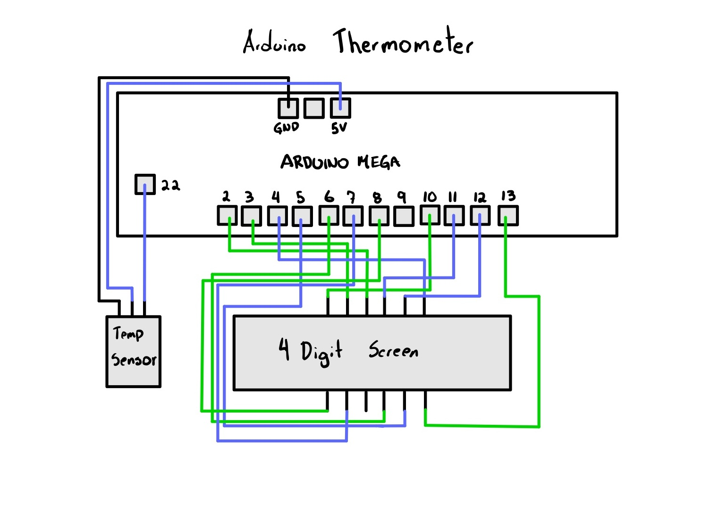
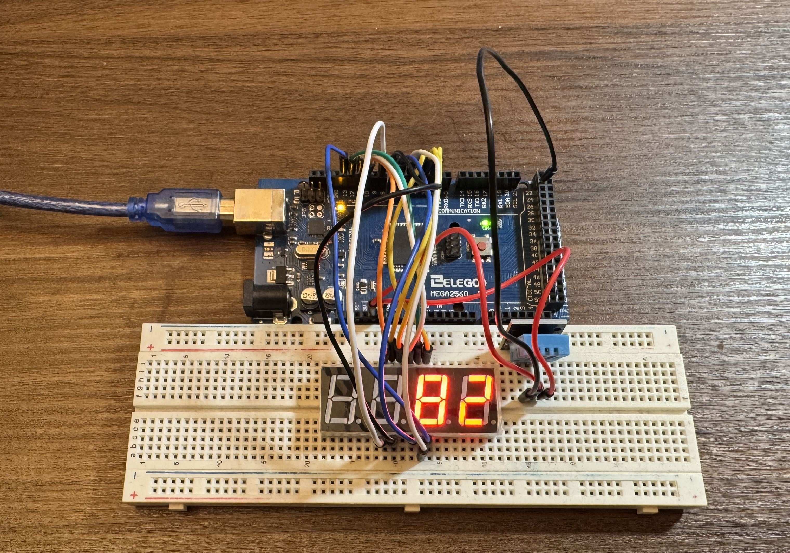

Arduino thermometer that reads and shows current temperature of environment using a DHT sensor and a ARDUINO Mega board. It displays the temperature on a 4 Digit 7-segment LED display. 

# Temperature Unit:
- Celsius: Comment out line 53 and uncomment line 54.
- Farenheit: Comment out line 54 and uncomment line 53.

Re-upload the code to your ARDUINO board if any changes are made.

# DESIGN SKETCH

# Project Image
